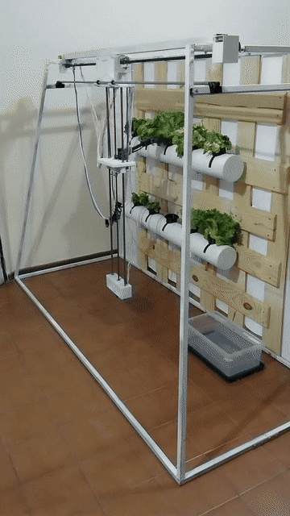

# Lettuce Harvesting Robot

Autonomous cartesian robot that scans a vertical hydroponic wall, finds ripe lettuce, and harvests it with a two-DOF arm and gripper. Built as a final undergraduate project in Mechatronics Engineering (UNCuyo). The project is complete; this repository is no longer under active development.

[Full demo video](media/harvest_demo.mp4) · [Static photo of the build](Informe/img/estructura.jpg)

## What it does

The robot moves along a 2-axis cartesian frame (belt-driven horizontal axis, lead-screw vertical axis) mounted in front of a wall of PVC tubes holding hydroponic lettuce. It scans the wall, locates each growing tube, classifies what's in it (mature lettuce / seedling / empty), and — for mature lettuce — drives a 2-DOF arm with a gripper to pick it and drop it in a collection bin.

Position is never fully trusted open-loop: mechanical backlash introduces positioning error, so the robot corrects itself visually against black reference tape before each pick.

## Architecture

Two levels, talking over UART with a custom ASCII command protocol (`<CMD:param1,param2>`):

**Regulatory level (C, microcontroller)** — real-time control of the physical axes: stepper motor drivers, trapezoidal velocity profiles for acceleration/deceleration, an encoder for step tracking, and limit switches for homing and safety cutoffs. It exposes a small command set (`M` move, `H` home, `A`/`P` arm servos, `G` gripper, `S` emergency stop, `L?` limit status) and pushes asynchronous events (move completed, limit triggered, gripper state) back to the supervisor.

**Supervisor level (Python, Raspberry Pi)** — a state machine that orchestrates the whole harvest cycle: homing, wall scanning, per-tube classification, arm/gripper sequencing, and error recovery. It owns the camera, runs the vision pipeline, and issues movement commands to the regulatory level over UART.

## Vision: three detectors, three color channels

The vision system doesn't use one general-purpose model — it uses three small, deterministic classical-CV pipelines, each built around whichever channel best isolates its target from the hydroponic-wall background:

- **Reference tape detector (X/Y correction)** — black tape strips against white PVC tubes have almost no color, only a brightness difference. Uses the **V (value) channel of HSV**, inverse-thresholded, because V is invariant to hue shifts caused by lighting color temperature. This is what closes the loop on mechanical backlash before each pick.
- **Tube detector (row mapping)** — white PVC tubes barely stand out in color, so brightness alone isn't enough. Combines **Canny edge detection** with the **S (saturation) channel of HSV** (PVC is low-saturation, so inverting and thresholding S isolates tube-colored edges from green plant clutter), then applies directional morphological closing to reconnect fragmented horizontal edges.
- **Crop classifier (maturity)** — lettuce is green against a white/gray background, so this one runs on **HSV green segmentation**: a hue/saturation/value range tuned to lettuce foliage, cleaned up with morphological open/close, then classified by the area of the largest contour against a calibrated threshold (mature vs. immature/empty).

Each detector picks its channel based on which axis of color actually separates signal from background — brightness for black-on-white, saturation for white-on-green/white, hue+saturation+value for green-on-white.

## Results

Measured on bench, under controlled indoor lighting:

| Detector | Metric |
|---|---|
| Reference tape (marker) detection | 97.5% correct detections (195/200 images) |
| Tube detection | 92.9% recall (13/14), 4.7 mm mean localization error |
| Lettuce maturity classification | 88.2% weighted-average precision (3-class: mature / immature / empty), on a 25-image validation set |
| Vision-assisted grasp success | 80% of attempts |
| Open-loop positioning error | ~1% of commanded distance |

Sample sizes are small — this is bench validation on a single prototype, not a large-scale study.

## Limitations

This is a bench-validated prototype, not a field-tested product. It has run full harvest cycles in a controlled indoor setup; it has not operated in a greenhouse or under variable outdoor light.

The known failure mode is **lighting**. The vision pipelines were tuned and validated in the **800–1200 lux** range. Below that range, contrast drops and detection degrades — particularly the tape detector, whose false negatives were traced to reduced contrast under uneven lighting. There is no adaptive exposure or illumination compensation; the system assumes a stable, sufficiently bright light source.

Other known issues from testing: PETG-printed arm joints flex under load, introducing vibration that affects grasp reliability; the structure was validated at the scale of a single wall section, not a full-height production installation.

## Running it

- **Regulatory level**: Atmel Studio project under [`Nivel_Regulatorio/`](Nivel_Regulatorio/), flash to the microcontroller. See its [README](Nivel_Regulatorio/README.md).
- **Supervisor level**: Python 3 under [`Nivel_Supervisor/`](Nivel_Supervisor/), entry point `main.py`. `pip install -r Nivel_Supervisor/requirements.txt`. See its [README](Nivel_Supervisor/README.md).
- **Vision modules**: standalone detector scripts under [`Nivel_Supervisor_IA/`](Nivel_Supervisor_IA/), used both by the supervisor and for isolated testing/calibration. See its [README](Nivel_Supervisor_IA/README.md).

Full technical writeup (mechanical design, control theory, vision pipeline derivations, cost analysis) is in [`Informe/`](Informe/) (Spanish, LaTeX).

## License

[MIT](LICENSE)
